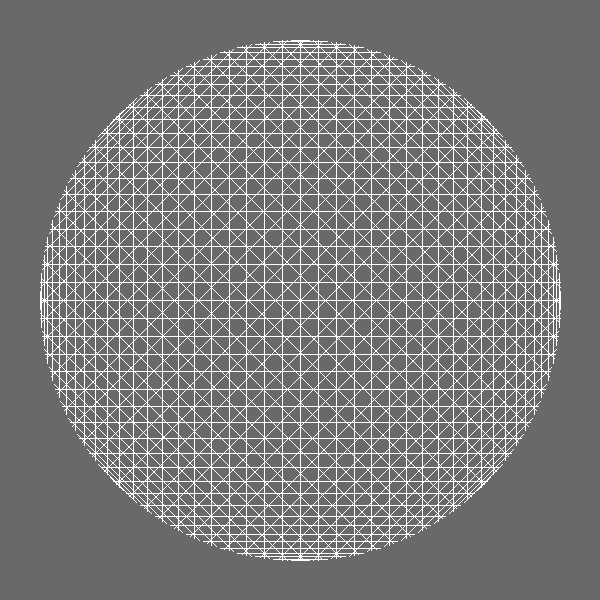

# Times-Tables-Visualization
A program that creates .jpg images of several visualized times-tables.  Prime numbers and numbers apart of the Fibonacci sequence create especially interesting patterns. 

Pictured is a cardioid created from the times table of the number 2.

Here is the peculiar number 89.  Seems to create some type of optical illusion.

